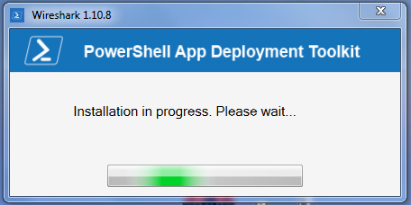

# Description
Simple System.Windows.Forms.Form that represent a popup to informe the user to wait during scripts tasks executions (Marquee style with progression information).

## Example of result

# Requirement
- powershell and .Net framework